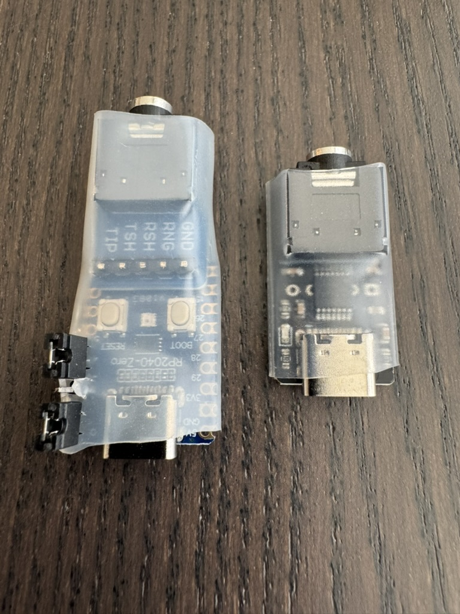
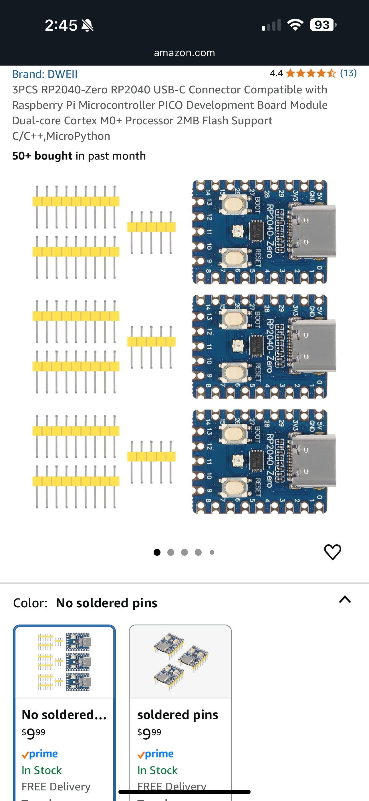
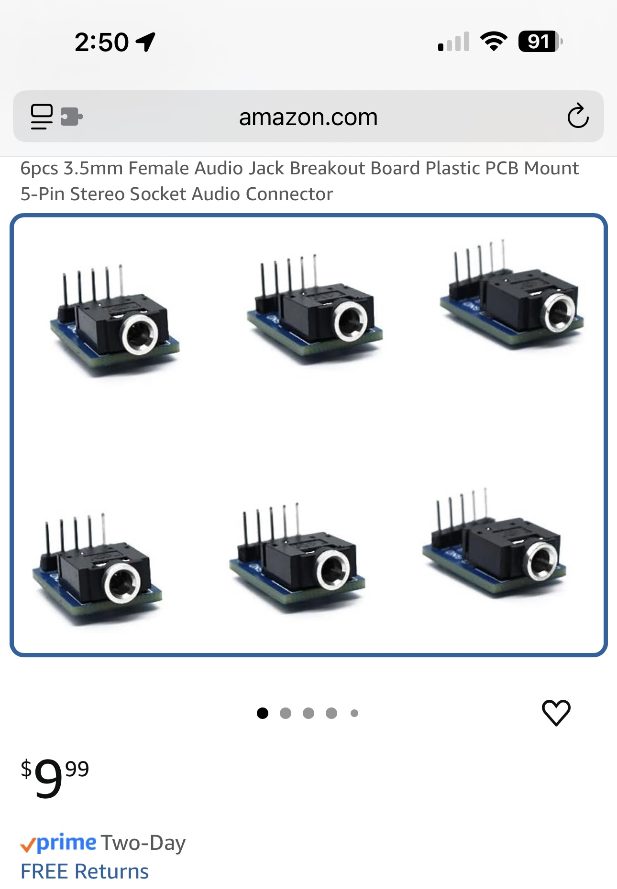
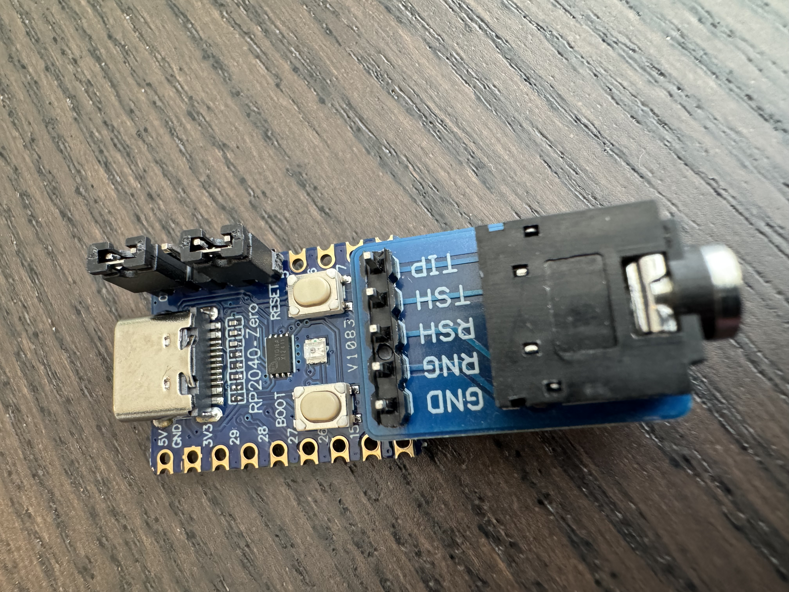

# A Pi Pico based vband CW/Morse USB 'dongle'

This is a heavily modified derivative of [grahamwhaley](https://github.com/grahamwhaley/pico_vband)'s repo.

This project started because I wanted to create a version of a morse code dongle for a smartphone
or computer that could be built by soldering a just a few few parts together, but would also be
compact and fairly robust, similar to commercially available dongles, but cheaper and more flexible
in how it could be used.  I looked for a small, cheap single-board computer that had a usb-C port
and I/O pins on the opposite side from the usb port.  I then looked for a pre-existing 3.5mm audio jack
or breakout board with the pins opposite and perpendicular to the jack and inline with the proper pin spacing.
I found these items readily available on Amazon, and I have documented them below.

The repo contains the code and instructions to build a USB dongle that allows a morse code
key or paddle to be connected to your computer like a USB keyboard, which then allows you to
interact with apps and websites such as:
[vband]( https://hamradio.solutions/vband/),
[Vail](https://vail.woozle.org/#) and
[morsecode.me](https://morsecode.me/#/help/practice).

## Finished result:

This is the finished dongle (on the left), with protective heat-shrink tubing in place, beside the
commercially available dongle from [Ham Radio Solutions](https://hamradio.solutions/vband/) (click the store tab if you want to purchase one from them)

## Supporting Smart Phone Apps
I am an iPhone developer, so I wanted to use an iPhone app to assist learning Morse Code.
Looking at the iOS App Store, there are a huge number of apps that claim to teach Morse Code,
but unfortunately, as far as I can tell, most are very low quality, or they go about things
in a way that I found not at all helpful, like flashing the flashlight or screen, or showing
literal dots and dashes on the screen.  All experts say you should learn Morse Code by
learning to recognize the sound of the characters, and that makes sense to me.  I found
a couple of good apps that do this, and also are written to recognize input from a keyboard
for a key or paddle, just as this dongle supports.

## Recommended iPhone Apps
  -  [Morse-It](https://apps.apple.com/us/app/morse-it/id284942940)
  -  [MorseMania](https://apps.apple.com/us/app/morse-mania-learn-morse-code/id1511042196)

MorseMania is not configurable regarding which keyboard keys to use for key/paddle input, however,
Morse-IT is very flexible in this regard.  I setup Morse-It to use "[ for Dot and "]" for Dash input.
(To find these settings, go to settings/global/hardware interface/dits/dahs keys, under keyboard...)
By setting things up in this fashion, both Morse-It and MorseMania will be happ with the dongle in
the same configuration.

=========================================================================================================

## Building the Dongle:

### Parts:
A little searching on Amazon and I found these parts.  Hopefully these or equivalents are still available for you:

[Raspbery Pi Zero](https://a.co/d/10HAlBX)

=========================================================================================================

[3.5mm Audio Jack](https://a.co/d/6CnM4zE)

=========================================================================================================

You can use the header pins that come with the audio jack breakout PCB, pushing the *long* side of the pins
through from the *top* of the breakout PCB, then soldering them in place on the *bottom* side of the PCB.
Once the header pins are soldered on the bottom of the breakout PCB, then from the *top* of the RP240-Zero board,
push the long side of the soldered pins through holes *9-13*, on the end of the RP2040-Zero board, with
the breakout board sitting flush against the top of the RP240-Zero.  Flip everthing over, and then solder the
pins in place on the *bottom* of the RP240-Zero board. Solder one pin in place trying to keep the two boards
in line as much as possible.  Reheat that one pin if needed, so that the two boards are parallel and there are
no unnecessary gaps between the two boards.  Once everything looks good, then solder the remaining pins.

If you want to be able to reconfigure the board for different websites or apps, then solder another header onto
pins *0-4* of the RP2040-Zero board.  You may need to cut one of the headers to the proper length (or just leave
the extra pins in place, they will just not be used for anything). Solder this pin header in the normal fashion,
pushing the short end of the header through from the *top* of the RP2040-Zero, then solder them in place on the
*bottom* of the board.  You can use jumpers to set which keys will be sent for dots/dashes, and to swap which
side of the paddle will send dots or dashes, if desired.

This is the bare dongle, without the optional protective heat shrink, showing how the header pins are to be
soldered in place:

Once you have completed soldering, you can trim the excess length of the pins that solder the breakout board to the RP240-Zero.
I found that 1 inch diameter 2:1 heat-shrink tubing works well to protect the dongle, once it is built.
If you choose to use the option headers, you will need to make a small slit in the tubing for the headers to poke through.
I found the easiest way to do this is make a small slit perpendicular to the line of pins for each separate pin, prior to heating the tubing.

=========================================================================================================

## Dongle Header Settings:
 -  No jumper 					= L-CTRL/R-CTRL		=>	*Supported by VBAND, Vail, and Morse-It iOS app*
 -  Jumper from pin 0-1	= [/]							=>  *Supported by VBAND, Vail, and Morse-It and MorseMania iOS apps*
 -  Jumper from pin 1-2	= x/z							=>  *Supported by Vail and Morse-It iOS app*
 -  Jumper from pin 2-3	= e/i							=>  *Supported by morsecode.me and Morse-It iOS app*

 - Jumper from pin 3-4	= Reverse dit/dah from paddle  =>  *Might be needed if the 3.5mm jack you get is backwards
 from what is expected, or if you prefer the paddle that way*

=========================================================================================================

## Websites

There are a few websites that enable
that, such as:

  -  [vband]( https://hamradio.solutions/vband/),
  -  [Vail](https://vail.woozle.org/#)
  -  [morsecode.me](https://morsecode.me/#/help/practice).

You can 'send' on those sites using your keyboard, but it's much nicer to be able to use your
morse key or paddle. To do this you require a 'dongle' that translates from your key into a
USB HID device - aka, looks like a keyboard.

There are a number of projects that already exist to do this, ranging from the very simple using
Aruduino-like micro controllers with anything from an Attiny to a SAMD21 processor. Here are some
samples I took inspiration from:

  - [sipsmi vband_dongle](https://github.com/sipsmi/vband_dongle/tree/main)
  - [MorsePaddle2USB](https://github.com/mgiugliano/MorsePaddle2USB)
  - [nealey vail-adapter](https://github.com/nealey/vail-adapter)

## Features

The dongle implements a number of features:

  - Supports single (straight) and dual (paddle) inputs
  - Supports various key output modes to be compatible with multiple sites
  - Mode changes through header pin jumpers
  - Activity feedback via an LED (if the board has one)

## Usage

Pretty much, plug your key or paddle into the dongle, plug your dongle into your computer,
go to the web site you wish to use, and see if it recognises the keystrokes. If the site does
not recognise the keystrokes you may need to press the 'mode' button to move to a mode that
matches the site. The following tables show which mode generates which keystrokes.

For precise details on which site supports which input characters, please refer to the specific
websites.

This the only library dependency:

  - [singleLEDLibrary](https://github.com/SethSenpai/singleLEDLibrary)

## Building for other boards

>  Note: If you don't want to build this from source, releases are not available as Pi Pico
>    uf2 files in the Releases section on the rhs of this page. See the
>    [Releases section](#releases) for more information.

There is nothing particularly specific to the Pi Pico in the code. If you port to another board
you will need to ensure it has hardware support for USB HID mode. The USB HID code is also the most
likely to need modifying, which may be as simple as changing the header files that are pulled in.

## Design/Implementation

The overall design is pretty simple. In the main loop, read the morse key/paddle inputs, and send the appropriate
characters over the USB HID keyboard interface. Also read the mode button to see if we need to
swap modes. Flash the LED when necessary. That is about it, but there are some subtleties:

Debouncing. This is probably the most subtle item. We debounce the morse inputs to try and not send
a stream of up/down key presses when really we only want one. Most debounce algorithms use some sort
of delay (be that a timer or a stream of reads) to assess when the input has settled down before
registering the event. I didn't want to do that, as I wanted to register the morse press as fast
as I could so as to remove any perceivable lag or delay. Thus, what we do to debounce is register the
key up as soon as we see a state change, but then ignore all other changes for a set debounce period.
Currently the debounce period is set to 10mS. That seems to be fairly standard-ish for how long it
takes a button to settle. Given a fast morse code 'dit' may get down to about 30mS, the 10mS delay
should not interfere with us registering strokes.

The other interesting tiny bit of code is the handling of the LED. Sadly the library I chose does not
have 'one shot' functions, so once you kick off a flash for instance then it will continue until you
cancel it. That's not always useful. Thus, I use the timer library to set a timer to cancel the LED
event at some future calculated time. It's a bit awkward, but seems to work.

## Notes about 'straight key' mode

In case it helps somebody down the line, we should briefly discuss 'straight key mode'. As far as
the dongle knows, there is no such thing. It will be in normal 'twin paddle' mode, but the straight
key will only be connected to one of the paddles. Generally (possibly depending on the target
website) it should not matter which paddle pin the key is connected to.

When you depress your straight key for a 'dit' or a 'dah', the dongle does not know or try to determine
if you are trying to send a 'dit' or a 'dah'. All it does is send the up and down keystrokes and the
website software determines if you sent a 'dit' or 'dah', depending on how long you held the key down.

You may have to tell whichever website or software you are using with the dongle that you are operating
in straight key mode, otherwise it may default to presuming you are using a paddle.

## Releases

To make life a little easier for those who are not au-fait with installing and building Arduino
projects, releases are now made and placed in the [Releases area](https://github.com/grahamwhaley/pico_vband/releases).

To use the uf2 files in the releases you [boot your Pico in USB flash drive mode and drag the uf2
file onto the drive](https://www.raspberrypi.com/documentation/microcontrollers/pico-series.html#resetting-flash-memory). This is the normal way to load a uf2 file onto a Pi Pico.
